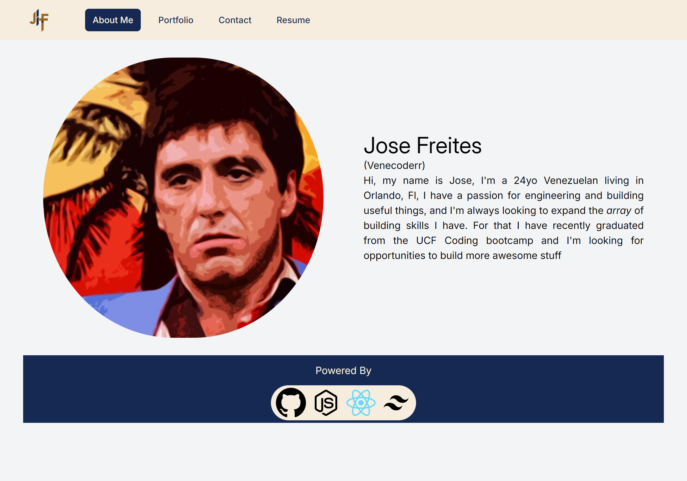
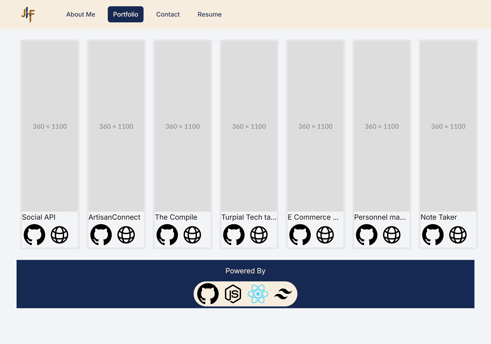
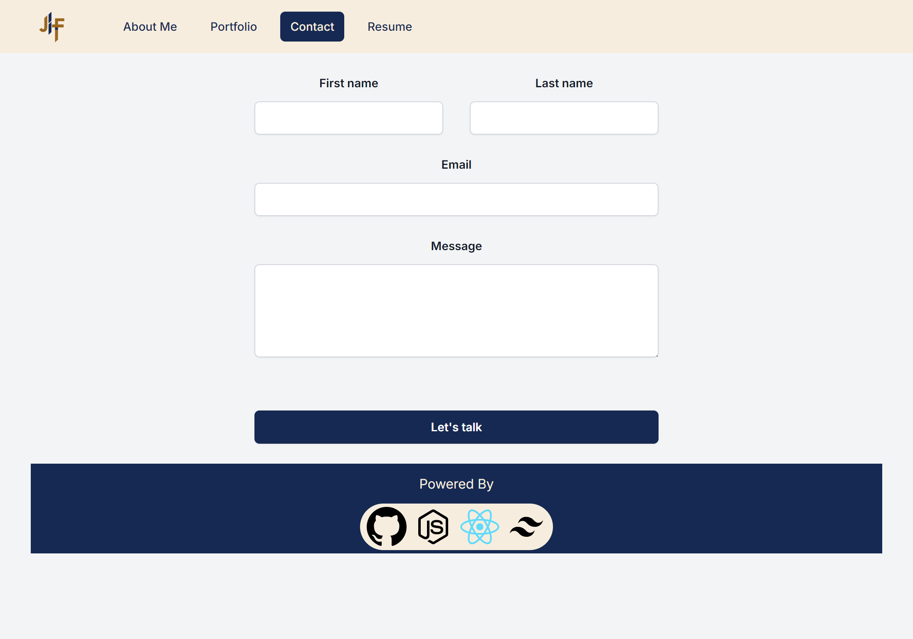
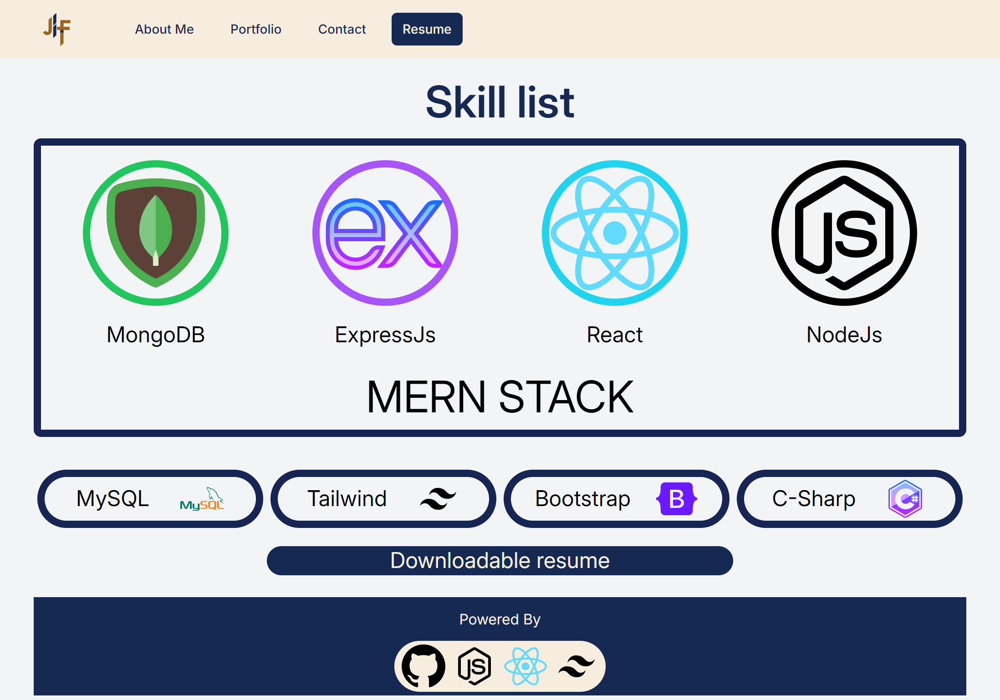

# The Compile

## Description

To show my skills and design style to potential employers I built this portfolio website not just showcasing previous projects I have built but also the portfolio itself it's built with the technologies that will make me a valueable asset to any organization

## Table of Contents

- [Installation](#installation)
- [Usage](#usage)
- [Questions](#questions)
- [Deployment](#deployment)
- [License](#license)

## Installation

The npm i command will take care of all required dependencies

## Usage

Upon loading you'll be welcome by the landing page, you can find a short bio of me here next to a linkedin and github links. 

By clicking portfolio you can see my previous projects there's also links to repos and deployed version under the thumbnails. 

By clicking in contact you can fill out a form to get in touch with me, I'll get back to you shortly.

By clicking resume you can find a quick summary of my coding proficiencies and a link to download a PDF copy of my resume

## Tests

No testing provided at this time

## Deployment

## Questions

For questions contact me at [Github](https://github.com/venecoderr) or [Email me](mailto:josefrm.55@gmail.com)

## License

This project is under the GPL-3.0 license
